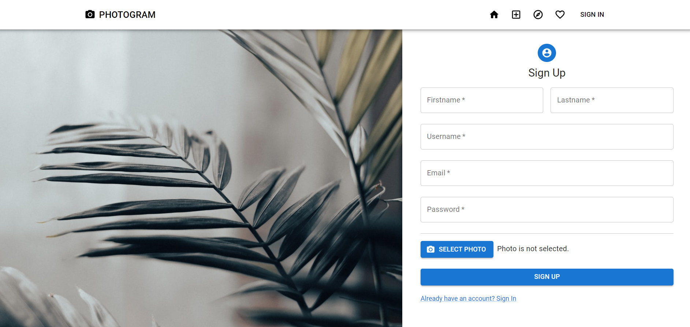
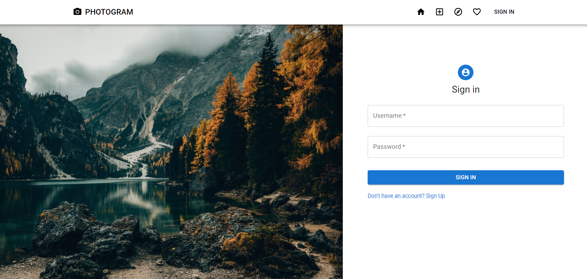
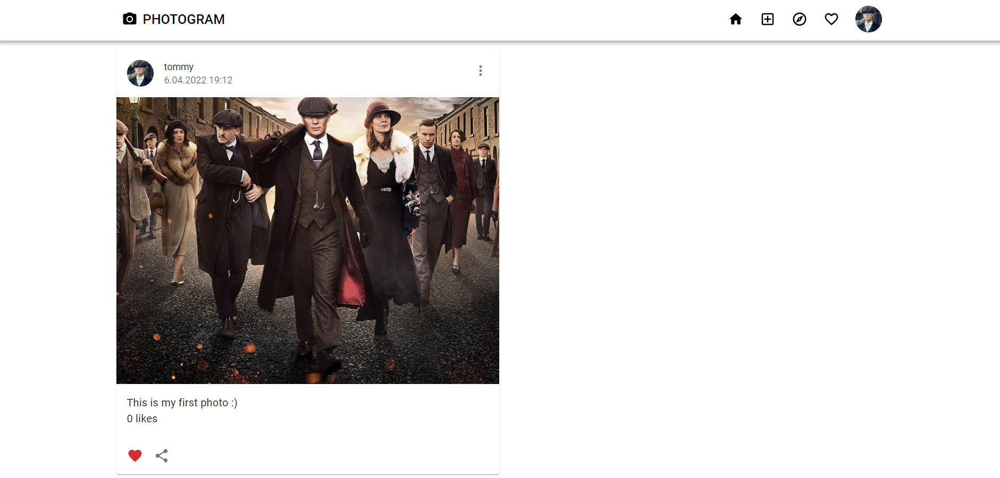
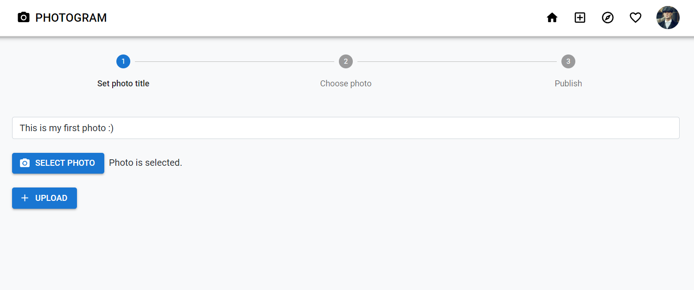
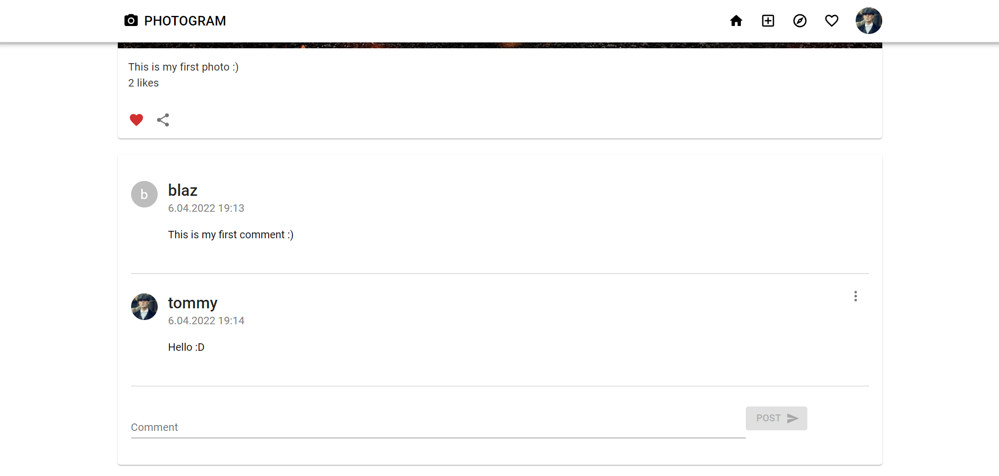

# Photogram 

Photogram is a simple web app, similar to Instagram.

## Implemented functionality: 
- sign in/sign up,
- uploading photos,
- browsing other users photos,
- liking and commenting photos,
- reporting photos (5 reports hide the photo),
- algorithm for sorting photos by score (likes, reports) + time decay ([more here](https://github.com/clux/decay)),
- showing message with snackbars,
- light and dark mode switch.

## Images:
### Register page
&nbsp;&nbsp;&nbsp;&nbsp;
### Login page
&nbsp;&nbsp;&nbsp;&nbsp;
### Home page
&nbsp;&nbsp;&nbsp;&nbsp;
### Publish photos page
&nbsp;&nbsp;&nbsp;&nbsp;
### Comment section

## Technologies &nbsp;  
This application was developed in [Visual Studio Code](https://code.visualstudio.com/) using MongoDB, Express, React and NodeJS (MERN stack).   

 
## Author 👋
This app was developed by [Blaž Čerpnjak](https://github.com/blaz-cerpnjak), who is currently a student at Faculty of Electrical Engineering, Computer Science and Informatics, University of Maribor. 
This app was an exercise in one of the subjects.
